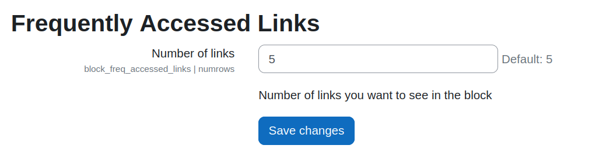
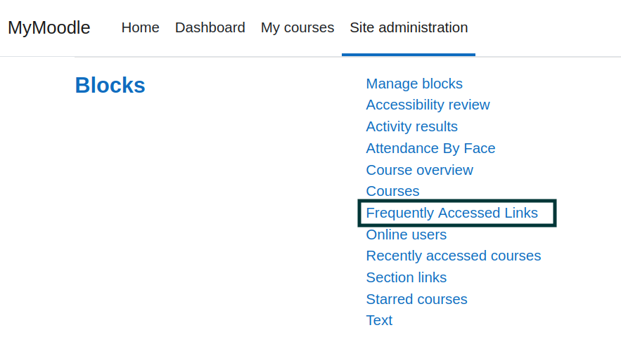
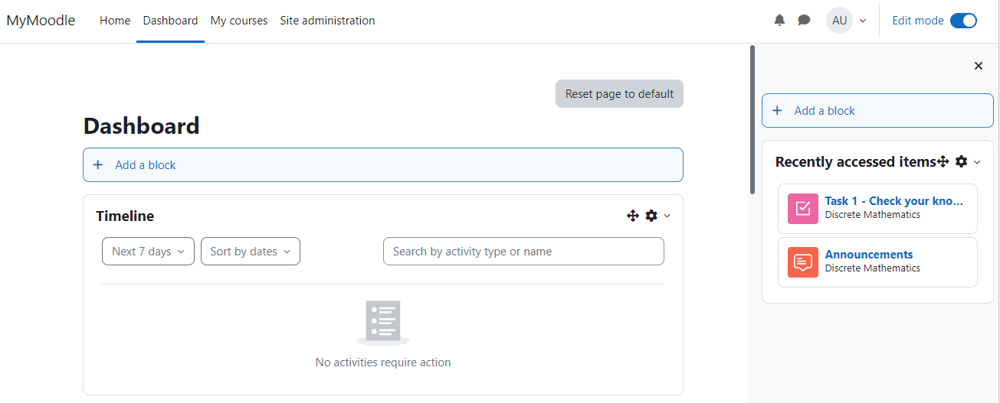
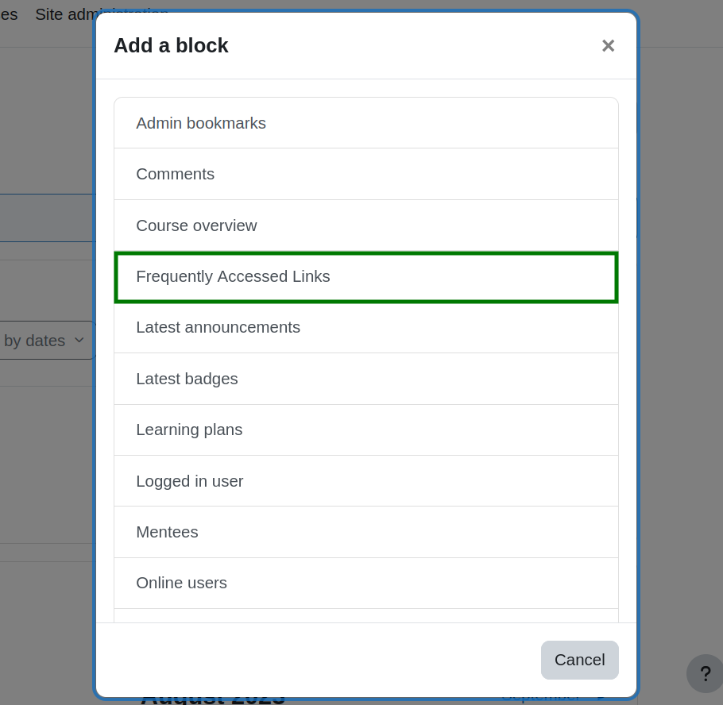
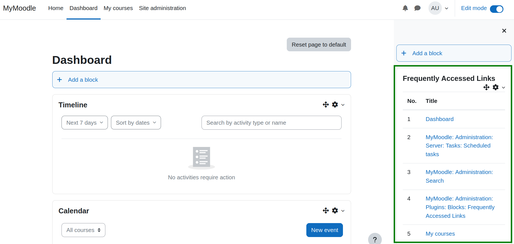

# Frequently Accessed Links

<p align="center">
  <a href="" rel="noopener">
 </a>
</p>

<h3 align="center">Moodle-Block Frequently Accessed Links</h3>

<div align="center">

[]()
[](https://github.com/eLearning-BS23/moodle-block_freq_accessed_links/issues)
[](https://github.com/eLearning-BS23/moodle-block_freq_accessed_links/pulls)
[](/LICENSE)

</div>

<p align="center"> Shows frequently accessed links in block plugin
    <br> 
</p>

## 🧐 About <a name = "about"></a>

Introducing the "Frequently Accessed Links" Block Plugin for Moodle – a dynamic tool that highlights frequently accessed links based on user interactions. Users are provided with a list of webpage titles they have visited, ranked by visit frequency. Clicking on these titles allows users to swiftly navigate back to the corresponding pages.

## 🏁 Getting Started <a name = "getting_started"></a>
Welcome to the installation guide for <b>requently Accessed Links</b>, block plugin. Following these instructions will enable you to obtain a copy of the project and successfully run it on your machine.

### Install by downloading the ZIP file

- Download zip file from <a target="_blank" href="https://moodle.org/plugins/block_freq_accessed_links">Moodle plugins directory</a> or <a target="_blank" href="https://github.com/eLearning-BS23/moodle-block_freq_accessed_links">GitHub</a>.

- Unzip the zip file inside blocks folder of your moodle project directory.

```
{moodle folder}/blocks/
```
 <b>or</b>
  
   - Upload the zip file in the install plugins options from site administration.

```
Site Administration ➜ Plugins ➜ Install Plugins ➜ Upload zip file
```

In your Moodle site (as admin), Visit site administration to finish the installation.

### Install using git clone

Go to moodle project directory

```
cd {moodle folder}/blocks/
```

and clone code by using following commands:
```
git clone https://github.com/eLearning-BS23/moodle-block_freq_accessed_links
```
rename the folder name as **freq_accessed_links** and refresh the site.

## ⚙️ Configuration

After installing the plugin, you will get an option in the settings page to limit number of links you want to see in your block plugin



### Settings

To update the plugin settings, navigate to plugin settings

```
Site Administration ➜ Plugins ➜ Blocks ➜ Frequently Accessed Links
```



## 💡 How to use

### <span id='add-plugin'>Adding the block plugin</span>
 - To add the block plugin enable <b>Edit Mode</b> at dashboard.
 

 - Select the block plugin named as <b>Frequently Accessed Links</b> from this list.
 

 - Block plugin is added successfully.
 

## FAQ’s:
1. How can I update number of links? 
  
    > Please open the settings page to update number of links. <a href="#settings">Click Here</a>
2. Why its showing 5 links when the number of links is given 0 in the settings?
    > As 0 is an invalid value that's why its working with the default value which is 5. 